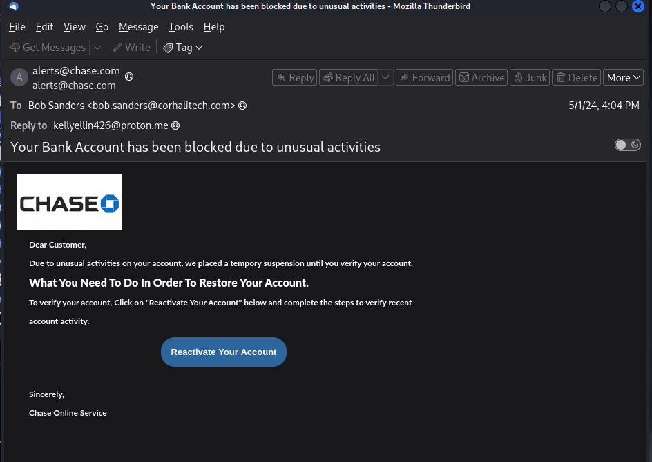
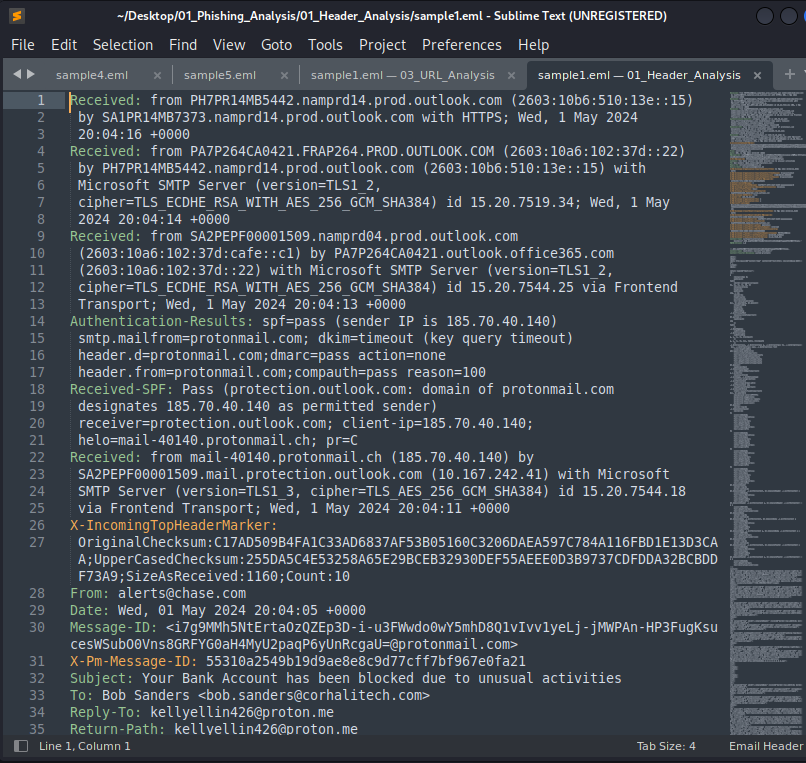

# Phishing Email Analysis Lab Report

## 1. Overview
This lab involved analyzing multiple phishing email samples (5–8) to understand different attack techniques including email spoofing, malicious URLs, and malicious attachments.

The objective was to practice real-world SOC analyst workflows such as header analysis, URL inspection, and file reputation checks.

---

## 2. Tools Used
- Email header analysis (manual + parser tools)
- SPF / DKIM / DMARC validation
- PhishTank
- URLScan.io
- VirusTotal
- Wannabrowser (URL behavior simulation)
- Custom IOC extraction script (`eioc.py`)
- Sandbox environment for dynamic analysis

---

## 3. Analysis Methodology

### 3.1 Email Header & Sender Analysis
Several email samples were analyzed by inspecting:
- Sender IP address
- Reply-to mismatch
- SPF, DKIM, and DMARC authentication results

**Findings:**
- Some emails failed SPF authentication
- DKIM signatures were missing in multiple samples
- DMARC policies indicated possible spoofing attempts

📌 *Example screenshot: header analysis result*

---

### 3.2 URL Analysis
Suspicious URLs extracted from email bodies were analyzed using:

- PhishTank database
- URLScan.io rendering engine
- VirusTotal URL reputation
- Wannabrowser for safe execution simulation

**Findings:**
- Several URLs were flagged as phishing
- Some domains used URL redirection chains
- Fake login pages mimicking trusted services were observed

📌 *Example screenshot:  VirusTotal scan result*

---

### 3.3 Attachment Analysis
Email attachments were extracted and analyzed using:

- VirusTotal file scanning
- Hash reputation checks (SHA256, SHA1, MD5)
- Custom IOC extraction tool (`eioc.py`)

**Findings:**
- Some hashes were already reported as malicious
- Suspicious file types included `.docm` and `.pdf`
- Macro-based execution detected in some samples

Process Screenshots:

**Result Secreenshots**

---

### 3.4 Dynamic Analysis (Sandboxing)
Selected attachments were executed in a controlled sandbox environment to observe behavior.

**Observed behavior:**
- Network connection attempts to external domains
- Suspicious process spawning
- File system modifications in some samples

📌 *Example screenshot: sandbox behavior graph*

---

## 4. Indicators of Compromise (IOCs)

- Malicious Domains: `example-domain.com`
- File Hashes (SHA256): `xxxxx`
- Suspicious URLs: extracted via URLScan
- Sender IPs: flagged in SPF failures

---

## 5. Conclusion
The analysis confirmed multiple phishing techniques including spoofed emails, malicious URLs, and infected attachments. These samples demonstrate common real-world phishing strategies used in credential theft and malware distribution.

Overall, this lab improved understanding of:
- Email authentication mechanisms (SPF/DKIM/DMARC)
- URL reputation analysis
- File-based threat detection
- Sandbox behavior analysis

---

## 6. Notes
This report is based on simulated and publicly available phishing samples for educational purposes only.